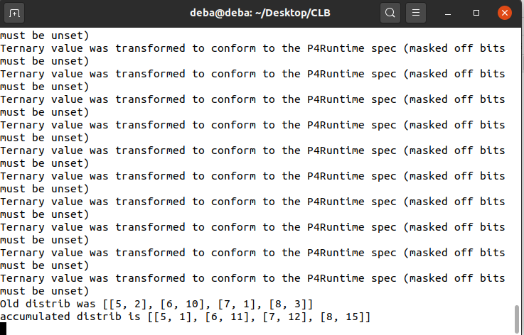
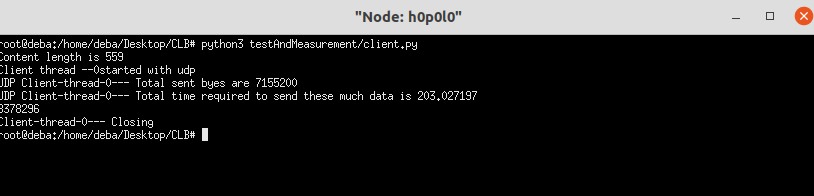

# How to setup the environment
    . Go to jfingerhut's github repository of P4-guide. (https://github.com/jafingerhut/p4-guide)
    . Use the install script you want to use appropriate for your distribution.
    . We have used the Ubuntu 20.04 version (https://github.com/jafingerhut/p4-guide/blob/master/bin/install-p4dev-v4.sh)

# # Now download the github repository for this project 
    . Link : https://github.com/drobinkent/CLB.git

# All the necessary libraries should be already installed in the system by now

# Compile the P4 code of CLB
    . make p4-clb 

# How this system works (Main configuration file for this project is "./ConfigConst.py" (All the file and folder path described in this doc are relative to the project directory)

# Configuring the Mininet based topology
    1) This system at first starts a fat-tree topology using mininet. 
    2) All the switches are bmv2 P4 software switch. So in the environemnt setup stage all the dependency should be installed in your machine
    3) Fat-tree topology needs to provide the maximum number of ports in a switch. And P4TE assumes that , there will be a common IP prefix for the whole DCN
    4) You need to configure 3 information in the file "MininetSimulator/ClosConstants.py"
        a) CLOS_MAX_PORT_NUMBER = 4 -- Here 4 is the maximum number of ports in the switches. You can use any even number for your network 4,8,16 etc
        b) DCN_CORE_IPv6_PREFIX = "2001:1:1:1:0:" -- Here the IPv6 prefix for the DCN is "2001:1:1:1:0:" you can use your own Ipv6 prefix. The system will allocate IPv^ addresses for the hists and switches it's ownself
        c) lastly you need to allocate IPv6 ports range for various use of the system 
            LEAF_SWITCH_GRPC_PORT_START = 60000 # 50000+i
            SPINE_SWITCH_GRPC_PORT_START = 61000 # 50500+i
            SUPER_SPINE_SWITCH_GRPC_PORT_START = 62000 # 50500+i
            CPU_PORT = 255 # we hope that we will never use 256 port of a device
            
            
            LEAF_SWITCH_THRIFT_PORT_START = 48000 # 50000+i
            SPINE_SWITCH_THRIFT_PORT_START = 52000 # 50500+i
            SUPER_SPINE_SWITCH_THRIFT_PORT_START = 50000 # 50500+i
            
            Each switch needs grpc and thrift port for various control plane communication. So in your machine either these mentioned port range should be free.
            Or you  have to allocate port range acoording to your machine

# Running the Mininet Topology
    1) after you have completed your desired configuration for the mininet emulator part, now it's time to run the emulator
    2) open a terminal and change the directory to project folder
    3) The folder contains a MAkefile 
    4) Just run the command "make start_clos" -- this command will start the clos (fat-tree topology)
    5) If everything is okay you should see an output like folllowing and that means the simulator have started. 

# Intermediate Information
    1) Once the mininet simulator have started, all the informations regarding the topology is writtem to an intermediate file and it is used 
        frequently in various places. This is defined as "MininetSimulator/Build/Internalnetcfg.json". Do not change it

# Running the control plane: This involves 3 steps
    a) Control plane configurations 
    b) Data plane configurations 
    c) Starting the flow with necessary configurations

# How to test the load balancer

## Control plane configurations 
Assume we want to test maximum load of C=64 packets per second over 4 links. 
Our precision of load-balancing is K=4 packets. So total weight group can be C/K = 64/4=16
Also you have to make sure that the sum of the path weights is at most 16. 
This maximum sum of weight is actually the cummulative weight distribution. 
So for C=64, K=4 the maaximum sum of the link weights should be 16. (The control plane will itself map 
it to 0-15 range as discussed in the paper).

    a) you define the distribution in "./ConfigConst.py". there are 2 variables for 2 distribution and 2 variables for defining after what dealy the control plane 
    will install/update the distribution
    
        LOAD_DISTRIBUTION_1 = [(5,2),(6,10),(7,1),(8,3)]
        LOAD_DISTRIBUTION_2 = [(5,7),(6,1),(7,6),(8,2)]
        DISTRO1_INSTALL_DELAY = 0   # Weight distribution 1 will be installed after 0 second of the controller thread starts
        DISTRO2_INSTALL_DELAY = 110  # Weight distribution 2 will be installed after 100 second of the controller thread starts
    b) We install the distribution in only one switch and do the per port load minitoring on a single switch. This is defined in following variable in 
        ConfigConst.py 
        
        CLB_TESTER_DEVICE_NAME = "p0l0" # As out target is only testing algorithm we will only run the CLB from one switch.

## Data plane configurations

We need 4 bits to represent the path weight (cummulative-weight) range 0-15.
So in make file in rule **p4-clb**, you have to set 

    a) DBITMASK_LENGTH = 16  # total bits for the the DistMask is C/K = 64/4=16
    b) DPRECISION_FACTOR = 3  # because for representing K=8 we need 3 bits
    c) DPRECISION_FACTOR=2 # because 4 =2^2 so we need 2 shift 2 times

####  Compile the P4 code of CLB using follwoing command 
        . make p4-clb 

## Starting the flow with necessary configurations

So we need 2 hosts. for a flow to generate maximum C=64 packets per second. 
The source must be connected with the **CLB_TESTER_DEVICE_NAME = "p0l0"** (Configured in CondigCost.py)  
to do that open the file **testAndMeasurement/CNF.py** . It has 3 configuration parameters 

    a) TOTAL_DURATION_OF_TEST = 200  # indicates how long we will run the test
    b) PPS=64  # This is the the configuration for desired maximum load per second. We need 64 pps so we write 64 
    c) SERVER_HOST = '2001:1:1:1::3:1' # this is the ip address of the destination. you get it from the mininet. 

# Running the test 

Steps 

    a) starting mininet : discussed earlier in the file. look at top
    b) for starting the controller : open another terminal and run **make start_ctrlr** This will start the control plane and it 
        will start installing the distributions afte rdesired time. So  you have to make a litle bit adjustment according to your speed. 
        A  suitable way is to run the experiment for long time. so set the **TOTAL_DURATION_OF_TEST** value with some high value.
        and also set **DISTRO1_INSTALL_DELAY and DISTRO2_INSTALL_DELAY** to large vlaue like 250, 650 . 

    You should see a output similar to this picture. This means your controller has started correctly. 
    c) then go to the terminal where you started mininet. Now assume the flow source is 
        h0p0l0 (connected with p0l0) and destination is h1p0l3 (we have configured it's ip in SERVER_HOST variable in testAndMeasurement/CNF.py file )
        
        Now run the follwoing  command in the mininet shell 
            -- xterm h0p0l0 h1p0l3    
        This will open 2 xterm shell for each of the 2 hosts
    d) Now go to the server host's  (h1p0l3) xterm shell and run follwoing command 

        $ python3 testAndMeasurement/server.py
        
        this will start a server program to recieive the packet sent by the source 
    e) Now go to the cleint host's  (h0p0l0) xterm shell and run follwoing command 
        $ python3 testAndMeasurement/client.py  
        this will start the flow from the source
    f) If everything foes correctly the client should stop after TOTAL_DURATION_OF_TEST seconds. and you shuold see something similar to the follwoing picture
    in the xterm window of the client host (h1p0l3)

    g) you can close the xterms. the exepriment is done

# Analyzing the result 

open a terminal window and go inside the directory where you have copied the CLB github repo. run the wollofing command 

    $ python3 LoadBalancerResultAnalyzer.py

this will analyze the logs collected by the controller and generate a graph (in the terminal you will also see the loads on the ports). 
you will find the graph representing the loads on each port at the following path

    /home/deba/Desktop/CLB/testAndMeasurement/TEST_RESULTS/CLB.pdf

------------------------------ END-----------------------

    
